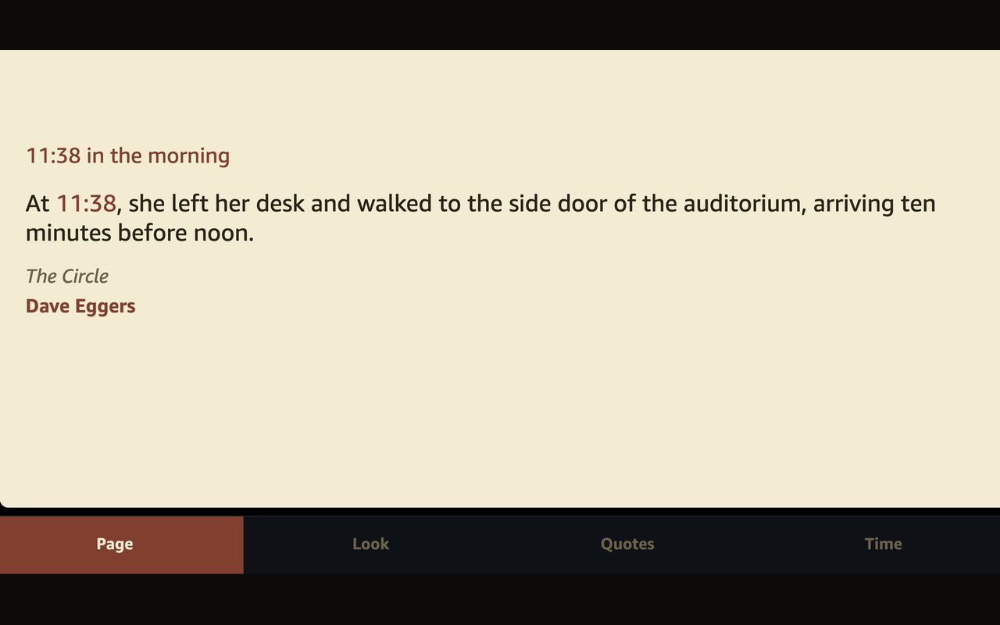

# Ink O'Clock

Alexa skill for the Literature Clock. The name on screen is **Ink O'Clock**. The words you say are **ink clock**.

She reads the line from the book, then the title and author. The clock phrase, such as "11:38 in the morning," stays on the Echo Show page and is not spoken. The microphone closes when she finishes. On a screen, the footer still works. For the next voice command, start again with "Alexa, ask ink clock…"

The page turns every **5 minutes** until you pick another schedule. Quotes are Johannes Enevoldsen's literature-clock collection, [CC BY-NC-SA 2.5](https://creativecommons.org/licenses/by-nc-sa/2.5/). Safer quotes are on by default. The minute follows the Echo's time zone.

Speakers stay voice-only. Echo Show and Fire TV also draw the line on a cream page. Hold the Fire TV remote mic and say **open ink clock**. Leave off any device name.

Privacy policy: [PRIVACY.md](https://github.com/markusvankempen/ink-oclock/blob/main/PRIVACY.md)

## Voice commands

| Say this | What happens |
|---|---|
| Alexa, open ink clock | The line for this minute |
| Alexa, ask ink clock what time it is | The same |
| Alexa, ask ink clock for three fifteen | The line for 3:15 |
| Alexa, ask ink clock what about 3:15 | The line for 3:15 |
| Alexa, ask ink clock for another line | A different passage for that minute |
| Alexa, ask ink clock turn the page | A different passage |
| Alexa, ask ink clock what are my settings | She reads the current look, schedule, and time zone |
| Alexa, ask ink clock options | Page, look, quotes, and time |
| Alexa, stop | Closes the book |

### Page turn

Default is every 5 minutes. Choices are 1, 5, 10, 15, 30, and 60.

| Say this | Schedule |
|---|---|
| Alexa, ask ink clock every five minutes | Every 5 minutes |
| Alexa, ask ink clock every thirty minutes | Every 30 minutes |
| Alexa, ask ink clock turn the page every ten minutes | Every 10 minutes |
| Alexa, ask ink clock every hour | Every 60 minutes |

If this Echo was already using the old 15-minute schedule, say **every five minutes** once. That becomes the saved setting.

### Look

| Say this | Look |
|---|---|
| Alexa, ask ink clock to use paper | Cream page (default) |
| Alexa, ask ink clock to use snow | White |
| Alexa, ask ink clock to use sepia | Aged paper |
| Alexa, ask ink clock to use sage | Green |
| Alexa, ask ink clock to use slate | Gray |
| Alexa, ask ink clock to use cinnabar | Red accent |
| Alexa, ask ink clock to use gallery | Ochre |
| Alexa, ask ink clock to use midnight | Dark |
| Alexa, ask ink clock to use forest | Dark green |
| Alexa, ask ink clock to use plum | Dark plum |
| Alexa, ask ink clock to use ocean | Dark blue |
| Alexa, ask ink clock to use honey | Yellow |

### Layout

Together (default) puts the clock, the line, and the author in one block, left aligned. Spread pins the clock at the top and the author at the bottom.

| Say this | Layout |
|---|---|
| Alexa, ask ink clock to keep them together | Together |
| Alexa, ask ink clock to center the text | Together |
| Alexa, ask ink clock to use spread | Spread |

The time, the line, and the author can each sit left, center, or right.

| Say this | What moves |
|---|---|
| Alexa, ask ink clock to align the time left | The clock phrase |
| Alexa, ask ink clock to center the quote | The line |
| Alexa, ask ink clock to put the author on the right | The author |

### Colors

Each of the time, the line, and the author can be ink, accent, muted, cinnabar, gold, or ocean. Accent follows the current look.

| Say this | Color |
|---|---|
| Alexa, ask ink clock to set the time color to gold | Time phrase |
| Alexa, ask ink clock to make the quote ink | The line |
| Alexa, ask ink clock to make the author cinnabar | The author |

### Quotes, clock, and time zone

| Say this | Setting |
|---|---|
| Alexa, ask ink clock safer quotes | Passages marked safe to read aloud (default) |
| Alexa, ask ink clock all quotes | The full collection for that minute |
| Alexa, ask ink clock use twelve hour | 12-hour clock on the page (default) |
| Alexa, ask ink clock use twenty four hour | 24-hour clock on the page |
| Alexa, ask ink clock use device timezone | The Echo's own zone (default) |
| Alexa, ask ink clock set timezone to eastern | Toronto / New York |
| Alexa, ask ink clock set timezone to atlantic | Halifax |
| Alexa, ask ink clock set timezone to central | Chicago |
| Alexa, ask ink clock set timezone to mountain | Denver |
| Alexa, ask ink clock set timezone to pacific | Los Angeles / Vancouver |
| Alexa, ask ink clock set timezone to london | London |
| Alexa, ask ink clock set timezone to u. t. c. | UTC |

## Settings on the screen

The footer is **Page**, **Look**, **Quotes**, and **Time**.

| Tab | Options |
|---|---|
| Page | The current line. It turns on the schedule above. |
| Look | Paper, Snow, Sepia, Sage, Slate, Cinnabar, Gallery, Midnight, Forest, Plum, Ocean, Honey. Then Together or Spread. |
| Quotes | Safer quotes or All quotes. Then, for Time, Line, and Author: left, center, or right, and ink, accent, muted, cinnabar, gold, or ocean. |
| Time | Every 1, 5, 10, 15, 30, or 60 min. 12-hour or 24-hour. Device time, Eastern, Atlantic, Central, Mountain, Pacific, London, or UTC. |

Defaults: Paper, Together, left aligned, safer quotes, time and author in the accent color, the line in ink, 12-hour, the Echo's time zone, page turn every 5 minutes.

Privacy policy: [PRIVACY.md](PRIVACY.md)

Contact: [Markus van Kempen](https://github.com/markusvankempen)

